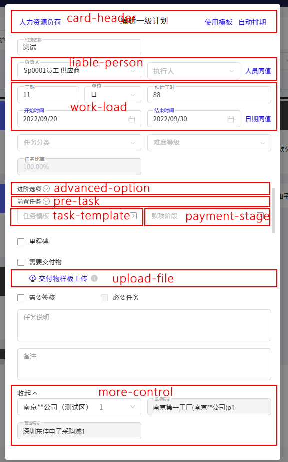

### add-subproject-card.component 组件
> 添加 & 编辑wbs任务卡片功能弹窗

##### 弹窗内功能交互说明

|               字段               |                                                                                                                                           交互逻辑                                                                                                                                           |
| ------------------------------- | ------------------------------------------------------------------------------------------------------------------------------------------------------------------------------------------------------------------------------------------------------------------------------------------ |
| 人力资源负荷                       | 人力资源负荷的开窗，根据负责人字段变化 里面的数据会变化                                                                                                                                                                                                                                                   |
| 使用模板                          | 编辑状态可以使用模板，选择使用模板后，当前编辑的任务卡会把模板里的子项作为自己的子项                                                                                                                                                                                                                              |
| 自动排期                          | 编辑状态展示，会修改当前任务卡的后置任务的时间                                                                                                                                                                                                                                                          |
| 任务名称                          | 必填项                                                                                                                                                                                                                                                                                       |
| 层级                             | 新建一级计划和编辑一级计划不显示，添加子项和编辑子项会显示，显示内容是当前列的所有项                                                                                                                                                                                                                              |
| 负责人 & 执行人                    | 1、负责人和执行人下拉列表的数据是一样的  2、负责人和执行人选中项不能相同，另一个需要置灰 3、任务类型里有个字段判断是否需要校验选中的人有没有授权，如果需要校验则需要调用api查询是否有授权，如果没有授权需要给出相应提示信息 4、如果切换了任务模板 相应的任务类型也会跟着改变，所以如果已经有选中的值 需要重新校验有没有授权 5、负责人为空，执行人不可选择 6、支持搜索 |
| 人员同值                          | 点击了人员同值，会把负责人和执行人赋值给子项                                                                                                                                                                                                                                                           |
| 工期 & 单位 & 工时 & 开始时间 & 结束时间 | 1、工期可以选择单位，填入工期后会自动计算预计工时 2、开始结束时间需要限制选择区间，区间为项目的起始时间 3、选择了开始结束时间，会重新计算工期和预计工时 4、选择了开始时间，需要根据工期自动填入结束时间                                                                                                                             |
| 日期同值                          | 点击了日期同值，会把日期赋值给子项                                                                                                                                                                                                                                                                  |
| 任务分类 & 难度等级                  | 下拉数据调用api，编辑状态根据任务状态判断是否可选                                                                                                                                                                                                                                                       |
| 任务比重                          | 如果项目状态 < 30则可以编辑，区间是0-100                                                                                                                                                                                                                                                             |
| 进阶选项                          |                                                                                                                                                                                                                                                                                            |
| -主单位                          | 为空预计值不能填                                                                                                                                                                                                                                                                               |
| -次单位                          | 为空预计值不能填                                                                                                                                                                                                                                                                               |
| -标准工时 & 标准天数                 | 前置任务下拉是当前所有任务卡，但是进行中的不可选择                                                                                                                                                                                                                                                       |
| 前置任务                          | 前置任务下拉是当前所有任务卡，但是进行中的不可选择                                                                                                                                                                                                                                                       |
| 任务模板                          | 任务模板关联更多模块 1、任务模板为空 某些栏位隐藏 2、任务模板有值 更多模块里固定，但是有的值禁填                                                                                                                                                                                                             |
| 里程碑                           | 选中出现备注框                                                                                                                                                                                                                                                                                 |
| 需要交付物 & 需要签核                | 根据4api里的字段回传是否选中                                                                                                                                                                                                                                                                      |
                                                                                                                                                                                                                                                                                        

##### 目录结构：

├─components //子组件
│  ├─advanced-option // “进阶选项”组件
│  ├─card-header //  顶部“人力资源负荷 & 自动排期 & 使用模板”
│  ├─is-need-doc-no //  “需要单别及单号”
│  ├─liable-person // “负责人 & 执行人”组件
│  ├─more-control  // “更多”内容组件
│  ├─payment-stage // “款项阶段”
│  ├─pre-task // “前置任务”
│  ├─task-template // “任务模板”
│  ├─upload-file // “上传交付物”
│  └─work-load // “工期 & 单位 & 预计工时 & 开始时间 & 结束时间”
├─directives // 指令目录
├─services // 服务
├─types // 类型定义
├─add-subproject-card.component.ts // 弹窗组件
├─add-subproject-card.service.ts // 弹窗服务
└─utils // 公共方法

##### 子组件示例图：

                                                                                                                                                                                                                                                                                     

